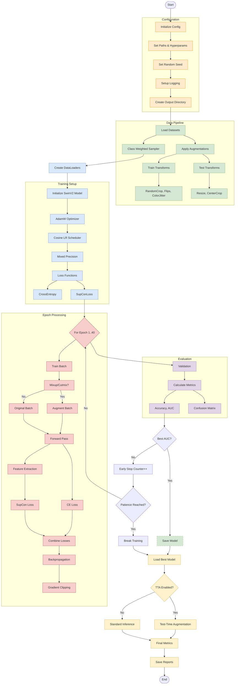

# Flowchart for Swin

```mermaid
flowchart TD
    %% Configuration
    A0([Start]) --> A1[Initialize Config]
    subgraph Configuration
        A1 --> A2[Set Paths & Hyperparams]
        A2 --> A3[Set Random Seed]
        A3 --> A4[Setup Logging]
        A4 --> A5[Create Output Directory]
    end

    %% Data Preparation
    A5 --> B1[Load Datasets]
    subgraph Data Pipeline
        B1 --> B2[Apply Augmentations]
        B2 --> B2a[Train Transforms]
        B2 --> B2b[Test Transforms]
        B2a --> B2c[RandomCrop, Flips, ColorJitter]
        B2b --> B2d[Resize, CenterCrop]
        B1 --> B3[Class Weighted Sampler]
    end
    B3 --> C1[Create DataLoaders]

    %% Model Setup
    C1 --> D1[Initialize SwinV2 Model]
    subgraph Training Setup
        D1 --> D2[AdamW Optimizer]
        D2 --> D3[Cosine LR Scheduler]
        D3 --> D4[Mixed Precision]
        D4 --> D5[Loss Functions]
        D5 --> D6[CrossEntropy]
        D5 --> D7[SupConLoss]
    end

    %% Training Loop
    D7 --> E1{For Epoch 1..40}
    subgraph Epoch Processing
        E1 --> E2[Train Batch]
        E2 --> E3[Mixup/Cutmix?]
        E3 -- Yes --> E4[Augment Batch]
        E3 -- No --> E5[Original Batch]
        E4 & E5 --> E6[Forward Pass]
        E6 --> E7[CE Loss]
        E6 --> E8[Feature Extraction]
        E8 --> E9[SupCon Loss]
        E7 & E9 --> E10[Combine Losses]
        E10 --> E11[Backpropagation]
        E11 --> E12[Gradient Clipping]
    end

    %% Validation
    E1 --> F1[Validation]
    subgraph Evaluation
        F1 --> F2[Calculate Metrics]
        F2 --> F3[Accuracy, AUC]
        F2 --> F4[Confusion Matrix]
    end

    %% Model Checkpointing
    F3 --> G1{Best AUC?}
    G1 -- Yes --> G2[Save Model]
    G1 -- No --> G3[Early Stop Counter++]
    G3 --> G4{Patience Reached?}
    G4 -- Yes --> G5[Break Training]
    G4 -- No --> E1

    %% Testing
    G2 & G5 --> H1[Load Best Model]
    H1 --> H2{TTA Enabled?}
    H2 -- Yes --> H3[Test-Time Augmentation]
    H2 -- No --> H4[Standard Inference]
    H3 & H4 --> H5[Final Metrics]
    H5 --> H6[Save Reports]
    H6 --> I1([End])

    %% Styling
    classDef config fill:#FFEBCC,stroke:#FF9800
    classDef data fill:#D5E8D4,stroke:#82B366
    classDef model fill:#DAE8FC,stroke:#6C8EBF
    classDef train fill:#F8CECC,stroke:#B85450
    classDef eval fill:#E1D5E7,stroke:#9673A6
    classDef test fill:#FFF2CC,stroke:#D6B656
    classDef save fill:#D5E8D4,stroke:#82B366,stroke-dasharray:5 5

    class A1,A2,A3,A4,A5 config
    class B1,B2,B2a,B2b,B2c,B2d,B3 data
    class C1,D1,D2,D3,D4,D5,D6,D7 model
    class E1,E2,E3,E4,E5,E6,E7,E8,E9,E10,E11,E12 train
    class F1,F2,F3,F4 eval
    class H1,H2,H3,H4,H5,H6 test
    class G2 save
```
